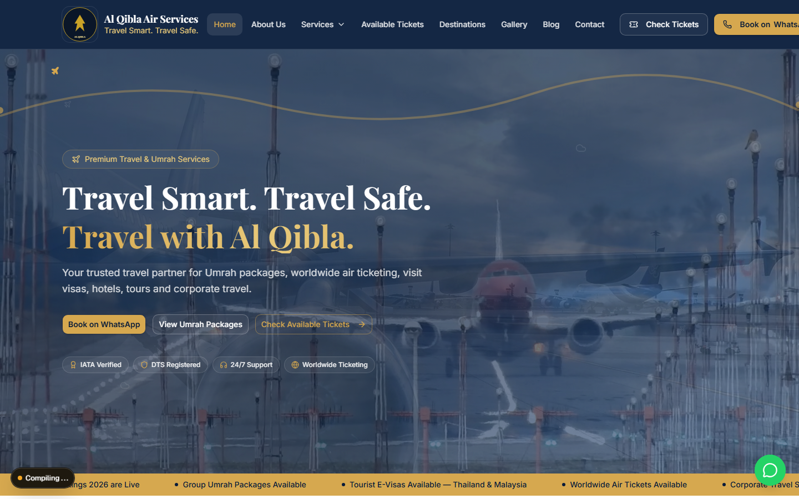
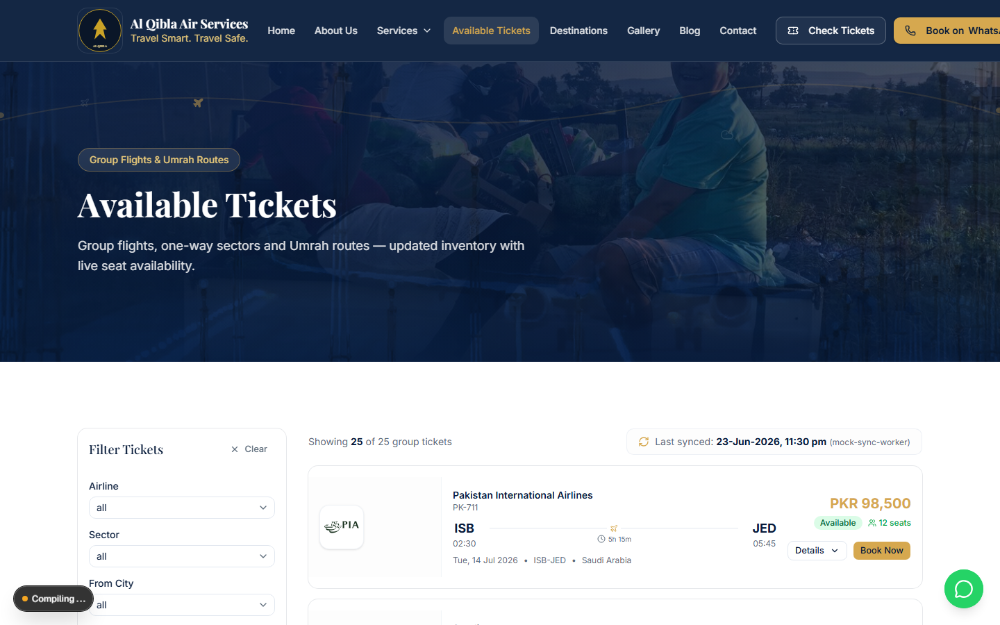
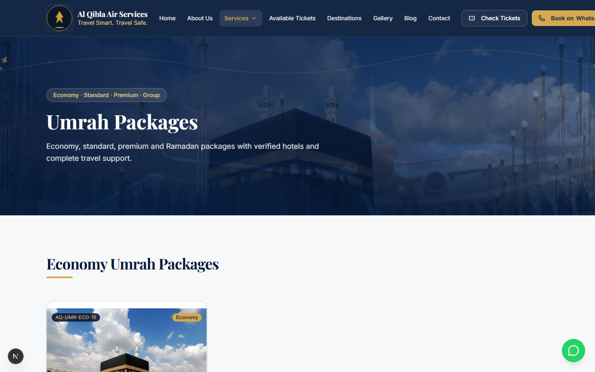
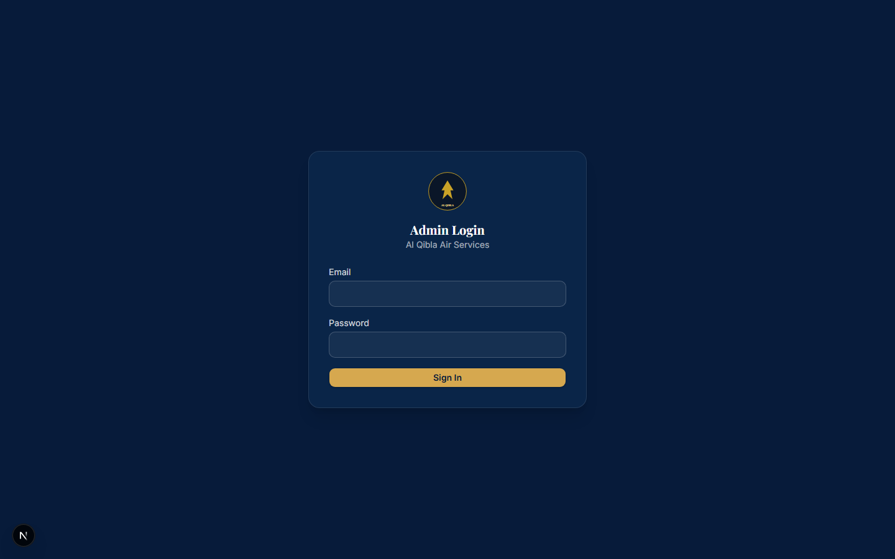
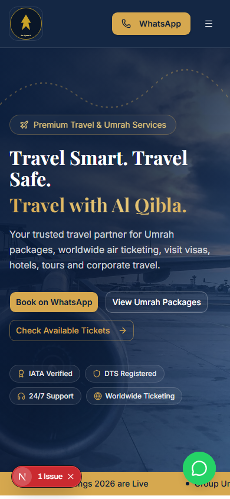

<div align="center">

  

  # Al Qibla Air Services

  **Travel Smart. Travel Safe. Travel with Al Qibla.**

  Premium travel agency platform for Umrah packages, worldwide ticketing, group flights, tours, visas, corporate travel, reviews, and admin-managed bookings.

  
  
  
  
  
  
  
  

</div>

---

## Project Showcase

**Al Qibla Air Services** is a premium travel agency website and travel management platform built for Umrah packages, international and domestic tickets, available group flights, visit visa services, hotel reservations, airport transfers, corporate travel, customer reviews, inquiries, and admin-managed content.

Designed for families, pilgrims, NGOs, and corporate clients across Pakistan, UAE, Saudi Arabia, Afghanistan, and worldwide.

## Live Preview

| | |
|---|---|
| **Live Website** | Coming Soon — deploy on [Vercel](https://vercel.com) |
| **Admin Dashboard** | `/admin` |
| **Demo Credentials** | Configure via Supabase Auth (do not commit real credentials) |

> **Note:** GitHub Pages static hosting is **not suitable** for this platform (admin auth, API routes, database writes, cron sync). Use **Vercel** or another Node-compatible host.

## Screenshots

Captured from the local dev build (`npm run capture-screenshots`).

| Homepage | Available Tickets |
|---|---|
|  |  |

| Umrah Packages | Admin Login |
|---|---|
|  |  |

| Mobile View |
|---|
|  |

## Key Features

- Premium responsive travel website with navy/gold branding
- Video/image hero sections with animated flight routes
- Umrah packages (economy, standard, premium, group, family, corporate)
- Tour packages worldwide
- Available tickets / group flights portal with filters
- Explore by destination cards
- Airline partners with logo fallbacks
- Flyers/posters carousel
- Gallery
- Blog & travel news
- **Customer review system** with admin approval workflow
- **Inquiry & booking forms** persisted to Supabase
- WhatsApp integration with prefilled messages
- Google Maps for Peshawar & Islamabad offices
- **Admin dashboard** with protected routes
- SEO metadata, sitemap, robots.txt, local business schema
- Future-ready ticket sync architecture (no unauthorized scraping)

## Website Pages

| Page | Route |
|------|-------|
| Home | `/` |
| About Us | `/about/` |
| Services | `/services/` |
| Umrah Packages | `/umrah-packages/` |
| Tour Packages | `/tour-packages/` |
| Available Tickets | `/available-tickets/` |
| Destinations | `/destinations/` |
| Corporate Travel | `/corporate-travel/` |
| Gallery | `/gallery/` |
| Blog / News | `/blog/` |
| Contact | `/contact/` |
| Book / Inquiry | `/inquiry/` |
| Admin Dashboard | `/admin/dashboard/` |

## Admin Dashboard

Authenticated admins can manage:

- Announcements
- Flyers / posters
- Tickets (inventory, seats, pricing)
- Umrah packages
- Tour packages
- Blog posts
- Reviews (approve / reject / feature)
- Inquiries (status, notes, CSV export)
- Gallery
- Airlines
- Site settings

**Routes:** `/admin/login/`, `/admin/dashboard/`, `/admin/reviews/`, `/admin/inquiries/`, and more.

See [SUPABASE_SETUP.md](./SUPABASE_SETUP.md) for database and auth setup.

## Motion & UI Experience

- `AnimatedFlightPath` — airplane icon along dotted route
- `FloatingAircraftLayer` — subtle background aircraft/clouds
- `MotionSection` — scroll reveal with reduced-motion support
- `PageHero` — reusable heroes on all inner pages
- Premium button variants (gold, navy, outline light/dark, WhatsApp)
- Hero video fallback with poster image
- Mobile-optimized animations

## Tech Stack

| Layer | Technology |
|-------|------------|
| Frontend | Next.js 16, React 19, TypeScript |
| Styling | Tailwind CSS 4, shadcn/ui, tw-animate-css |
| Icons | Lucide React |
| Animation | Framer Motion |
| Backend | Supabase (PostgreSQL, Auth, Storage, RLS) |
| Validation | Zod |
| Notifications | Sonner |
| Deployment | Vercel (recommended) |

## Folder Structure

```
src/
├── app/                    # App Router pages & API routes
│   ├── admin/              # Protected admin dashboard
│   └── api/                # reviews, inquiries, cron sync
├── components/
│   ├── admin/              # Admin sidebar, CRUD placeholders
│   ├── cards/              # Package, ticket cards
│   ├── forms/              # Inquiry forms
│   ├── home/               # Homepage sections
│   ├── layout/             # Header, Footer, WhatsApp
│   ├── motion/             # AnimatedFlightPath, MotionSection
│   ├── reviews/            # Review form, star rating
│   └── shared/             # PageHero, AirlineLogo, etc.
├── data/                   # Development fallback seed data
├── lib/
│   ├── supabase/           # Client, server, admin clients
│   └── tickets/providers/  # Ticket sync abstraction
public/assets/              # Logo, flyers, gallery, airlines
supabase/                   # schema.sql, seed.sql
```

## Environment Variables

Copy `.env.example` to `.env.local`:

```env
NEXT_PUBLIC_SITE_URL=http://localhost:3000
NEXT_PUBLIC_WHATSAPP_NUMBER=923315576169
NEXT_PUBLIC_SUPABASE_URL=
NEXT_PUBLIC_SUPABASE_ANON_KEY=
SUPABASE_SERVICE_ROLE_KEY=
CRON_SECRET=
ADMIN_EMAIL=
```

> **Never expose `SUPABASE_SERVICE_ROLE_KEY` on the client.**

Without Supabase env vars, the site runs in **development fallback mode** using seed data from `src/data/*`.

## Local Setup

```bash
npm install
npm run dev      # http://localhost:3000
npm run build
npm run lint
npm run capture-screenshots   # requires dev server running; saves to public/assets/readme/
```

## Supabase Setup

1. Create a [Supabase](https://supabase.com) project
2. Run `supabase/schema.sql` in the SQL Editor
3. Optionally run `supabase/seed.sql`
4. Create storage buckets: `flyers`, `gallery`, `packages`, `blog`, `airlines`, `heroes`, `reviews`
5. Add environment variables to `.env.local`
6. Create admin user in Supabase Auth + insert `profiles` row

Full guide: [SUPABASE_SETUP.md](./SUPABASE_SETUP.md)

## Deployment (Vercel)

1. Push repository to GitHub
2. Import project in [Vercel](https://vercel.com)
3. Add all environment variables
4. Deploy — API routes and admin work automatically
5. Optional: configure Vercel Cron for `/api/cron/sync-tickets/`

## Asset Guides

- [ASSET_GUIDE.md](./ASSET_GUIDE.md) — folder structure
- [MISSING_ASSETS.md](./MISSING_ASSETS.md) — images to add
- [MISSING_AIRLINE_LOGOS.md](./MISSING_AIRLINE_LOGOS.md) — airline logos

## Business Contact

**Head Office — Peshawar**  
OFFICE#4 BLOCK-B, CANTONMENT PLAZA, Saddar Rd, Peshawar Cantonment, Peshawar, 25000  
Phone: 0345 9112552

**Islamabad Branch**  
Office No.11, Askan Center, E-11/3 Markaz, Islamabad

**WhatsApp:** +923315576169

**Social:**  
[Facebook](https://www.facebook.com/Alqiblaairservices/) · [Facebook Group](https://www.facebook.com/groups/201739273367417/) · [Instagram](https://www.instagram.com/alqiblaairservices/) · [X/Twitter](https://x.com/alqiblair)

## Roadmap

- [ ] Real-time ticket provider / official API integration
- [ ] CSV ticket import UI in admin
- [ ] More destination package images
- [ ] Multi-language support (English / Urdu)
- [ ] Payment & invoice system
- [ ] Customer account portal
- [ ] Advanced analytics dashboard

## Compliance Note

This platform must only use **authorized** ticketing data sources — official APIs, partner access, CSV imports, or admin-managed inventory. Do not bypass login, private APIs, CAPTCHA, or protected third-party systems.

---

<div align="center">
  <sub>Built for Al Qibla Air Services · Travel Smart. Travel Safe. Travel with Al Qibla.</sub>
</div>
